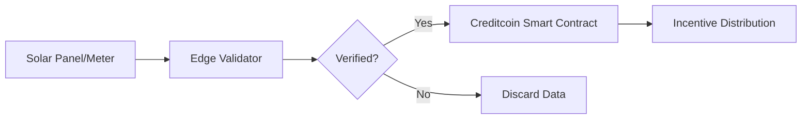

¹# Credit-Mesh
A Creditcoin-powered DePIN platform enabling communities to own, finance, operate, for example solar energy and earn from real-world infrastructure—transforming how distributed physical resources are funded, deployed, and monetized through transparent credit history.


---

# 🛰️ CreditMesh: Solar DePIN Protocol

**Empowering Community-Owned Energy Grids on Creditcoin.**

CreditMesh is a Decentralized Physical Infrastructure Network (DePIN) designed to solve the "coordination gap" in India's rooftop solar sector. By turning solar installations into verifiable network nodes, we enable automated, transparent, and instant settlements for energy production using the Creditcoin blockchain.

## 🌟 The Vision

To move energy infrastructure from a centralized, opaque system to a community-driven, transparent, and automated marketplace. CreditMesh proves that blockchain's best use case is not just finance, but the coordination of real-world physical assets.

---

## ⚡ Problem vs. Solution

| The Problem | The CreditMesh Solution |
| --- | --- |
| **Centralized Bottlenecks:** Slow net-metering approvals. | **Decentralized Settlement:** Instant on-chain credits. |
| **Wasted Surplus:** No easy way to share local energy. | **P2P Ready:** Solar nodes act as a unified grid. |
| **Data Silos:** Energy data is locked with utilities. | **Verifiable Truth:** Transparent, tamper-proof energy logs. |

---

## 🏗️ System Architecture

CreditMesh operates on a **Hybrid DePIN Architecture**:

1. **Hardware Layer (Simulated):** Smart meters collect generation data ().
2. **Edge Aggregator:** An off-chain backend validates data integrity and prevents "ghost" generation (sybil attacks).
3. **Settlement Layer (Creditcoin):** Aggregated data is sent to Creditcoin smart contracts to update the global state and trigger rewards.



---

## 🛠 Tech Stack

* **Blockchain:** Creditcoin (L1/L2)
* **Smart Contracts:** Solidity / Ink! (depending on the specific Creditcoin environment used)
* **Backend:** Node.js / Express (Data Aggregator)
* **Simulation:** Python (Modeling solar generation cycles)
* **Frontend:** React.js (Dashboard for Node Owners)

---

## 📂 Project Structure

```text
├── contracts/           # Solidity/Ink! smart contracts for CreditMesh
├── aggregator/          # Node.js backend for off-chain data validation
├── hardware-sim/        # Python scripts simulating IoT smart meter data
├── frontend/            # React dashboard to visualize energy production
└── README.md

```

---

## 🚀 Getting Started

### Prerequisites

* Node.js (v18+)
* Yarn or NPM
* A Creditcoin-compatible wallet/provider

### Installation

1. **Clone the repository:**
```bash
git clone https://github.com/your-username/creditmesh-depin.git
cd creditmesh-depin

```


2. **Install dependencies:**
```bash
npm install

```


3. **Deploy Smart Contracts:**
```bash
# Follow specific Creditcoin deployment steps
npx hardhat run scripts/deploy.js --network creditcoin

```


4. **Run the Hardware Simulator:**
```bash
python hardware-sim/simulate_meter.py

```


---

## 📜 Smart Contract Logic

The core of CreditMesh is the `EnergyVault.sol` contract. It tracks the cumulative contribution of each Node ID.

**Reward Formula:**


* **Transparency:** Anyone can audit the energy contribution of a specific node.
* **Efficiency:** By batching  data, we keep gas costs low while maintaining high security.

---

## 🗺 Roadmap

* [ ] **Phase 1:** Prototype smart contracts for Node registration.
* [ ] **Phase 2:** Develop the "Edge Validator" to prevent data tampering.
* [ ] **Phase 3:** Integration with EV charging APIs for local energy consumption.
* [ ] **Phase 4:** Pilot launch with 10 physical DIY smart meters.

